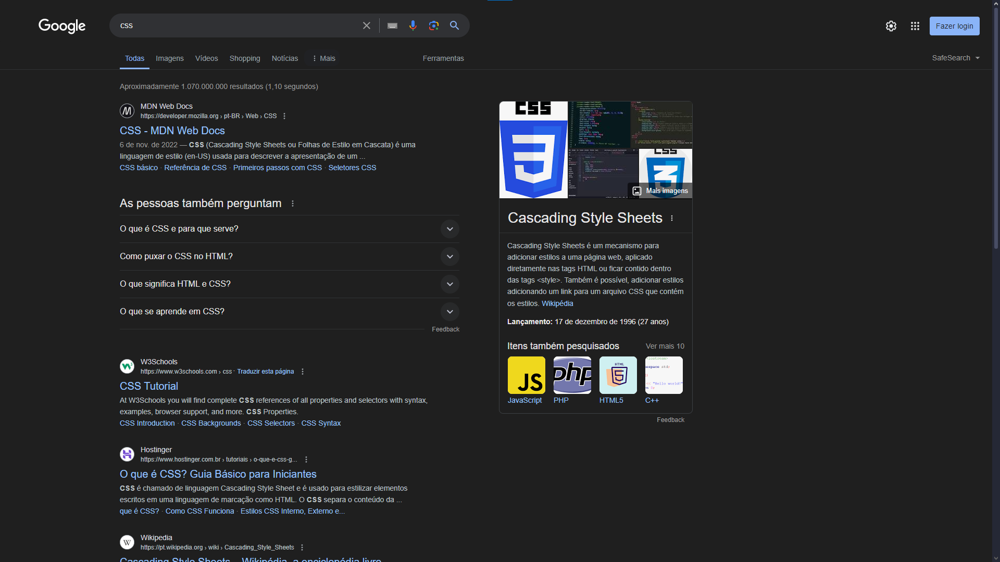
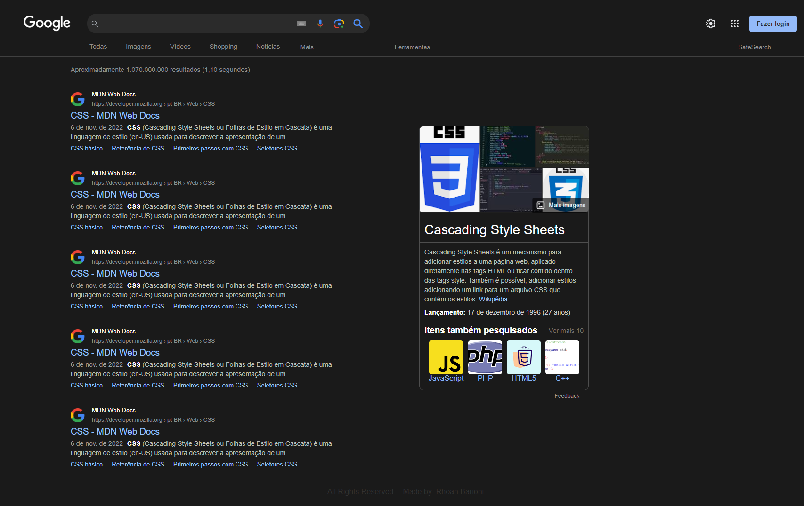

<h1>Clone Google Results</h1> 

This is exercise project about my knowledgement in class
 

I used these technologies:

    

 

Do u wanna see my site?

Here is the <a href="https://rhoanbarioni.github.io/clone_google_result/" target="_blank">Link</a>

<h1>Reference Page:</h1>

<h1>Result:</h1>

